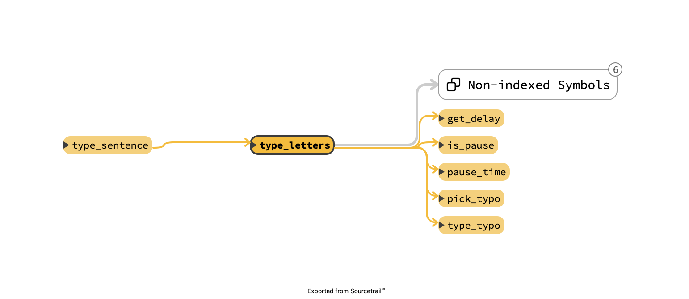

# Developper `README`

This `README` contains useful information if you want to work
on `runner`. For more general documenation, see the project's
[main](../README.md) `README`.

## Typing

## Testing

## Modules

### `human_typing.py`

The [human_typing](human_typing.py) module contains every function
that affects how the program types. If you want to make `runner`'s
typing even more human-like, this is where you should get started.

To try to make the used believe that someone is actually typing
on the command line, `runner` randomly introduces typos and delays.
The chances of making typos and the time between keystrokes is
based on different [papers](#references) on the subject.

The `type_sentence()` function uses every other functions in the
file to type a sentence in the most natural way possible. It splits
the sentence and sends each keypress to the `type_letters()` function.

`type_letters()` takes care of introducing the required typos and
delays.

#### Typos

Functions used to generate typose are:

* `is_typo()`: Determine whether or not there will be a typo based
  on percentage chances.
* `pick_typo()`: Picks a plausible typo (keys near the next one to
  press).
* `type_typo()`: Sends the typo to the child process and corrects it
  by sending a `\b` character and typing the correct character.

Chances of generating typos are defined in the `is_typo()` function,
while the plausible typos are defined with the `PLAUSIBLE_TYPO`
variable.

#### Delays

`runner` uses two different types of delays. There are delays
between *each* characters and delays between *some* words.

Functions used to compute delays are the following:

* `is_pause()`: To determine if there should be a pause between
  two words.
* `pause_time()`: Returns how long the pause between two words
  shoud be.
* `get_delay()`: Returns the delay between two keypresses.

##### Delays between characters

Typing speed is determined by how much time is spent between
each character typed. The delay is longer when we have to press
two consecutive keys using the same finger [1]. Studies have also
found which key combination are most likely to be typed by one or
two hands [3].

Using this information, a delay is computed before each keypress
by the `get_delay()` function.

##### Delays between words

## References

[1] A. M. Feit, D. Weir, and A. Oulasvirta, “How We Type: Movement Strategies and Performance in Everyday Typing,” in Proceedings of the 2016 CHI Conference on Human Factors in Computing Systems, San Jose California USA, May 2016, pp. 4262–4273. doi: 10.1145/2858036.2858233.

[2] R. Banerjee, S. Feng, J. S. Kang, and Y. Choi, “Keystroke Patterns as Prosody in Digital Writings: A Case Study with Deceptive Reviews and Essays,” in Proceedings of the 2014 Conference on Empirical Methods in Natural Language Processing (EMNLP), Doha, Qatar, 2014, pp. 1469–1473. doi: 10.3115/v1/D14-1155.

[3] V. Dhakal, A. M. Feit, P. O. Kristensson, and A. Oulasvirta, “Observations on Typing from 136 Million Keystrokes,” in Proceedings of the 2018 CHI Conference on Human Factors in Computing Systems, Montreal QC Canada, Apr. 2018, pp. 1–12. doi: 10.1145/3173574.3174220.
